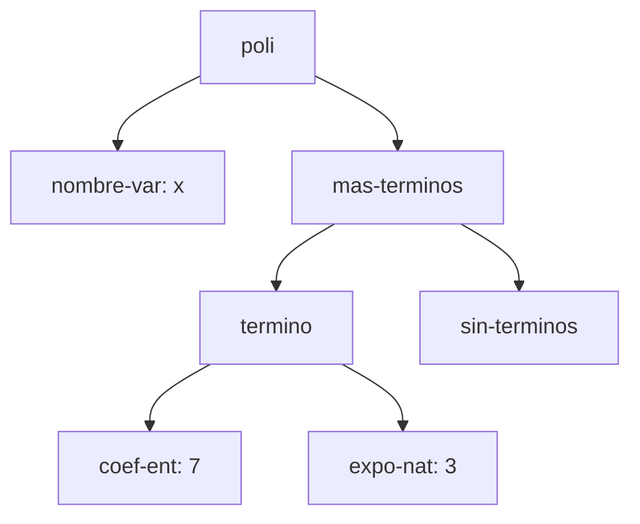
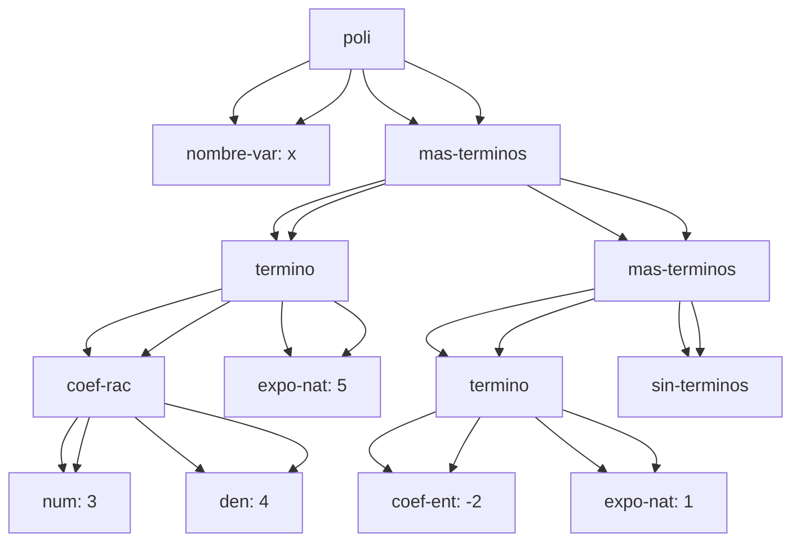
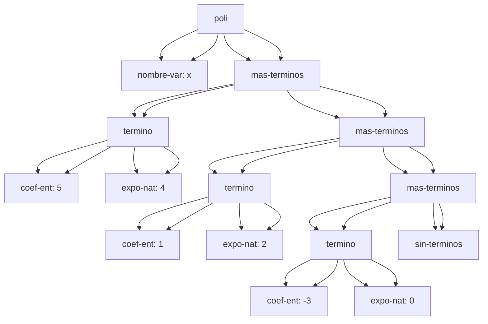
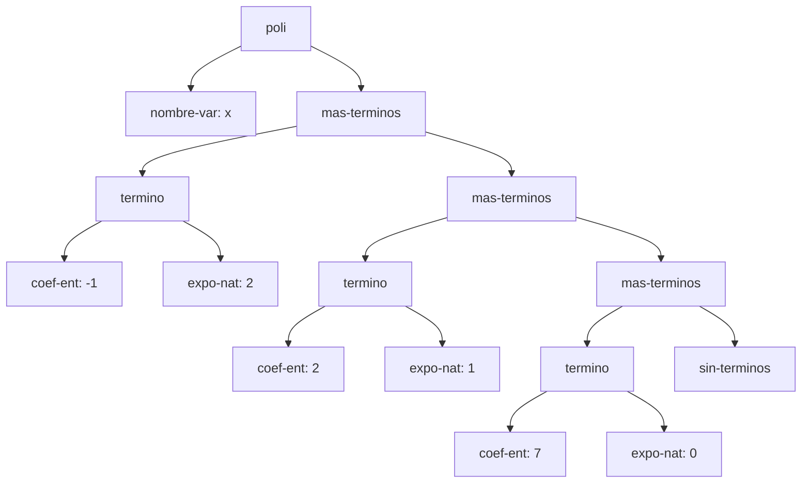

# Informe de AST — Taller 1: polinomios dispersos

**Curso:** Fundamentos de Interpretación y Compilación de Lenguajes
de Programación — Universidad del Valle, Sede Tuluá.

**Integrantes del grupo:**

| Nombre | Código | Correo institucional |
|--------|--------|----------------------|
| Samuel Garcia Parra | 2459476 | samuel.parra@correounivalle.edu.co |
| Juan Sebastian Navarrete | 202459562 | {{correo2@correounivalle.edu.co}} |


---

## 1. Gramática considerada

```bnf
<polinomio>   ::= <variable> <terminos>
                   poli(var, terms)

<variable>    ::= <symbol>
                   nombre-var(s)

<terminos>    ::= '()
                   sin-terminos()
              ::= <termino> <terminos>
                   mas-terminos(term, resto)

<termino>     ::= <coeficiente> <exponente>
                   termino(coef, expo)

<coeficiente> ::= <int>
                   coef-ent(n)
              ::= <int> "/" <int>
                   coef-rac(num, den)

<exponente>   ::= <int>
                   expo-nat(k)
```

| No terminal | Variantes del datatype | Campos |
|---|---|---|
| `<polinomio>` | `poli` | var, terms |
| `<terminos>` | `sin-terminos`, `mas-terminos` | (ninguno) / term, resto |
| `<termino>` | `termino` | coef, expo |
| `<coeficiente>` | `coef-ent`, `coef-rac` | n / num, den |
| `<exponente>` | `expo-nat` | k |
| `<polinomio>` | `poli` | var, terms |
| `<terminos>` | `sin-terminos`, `mas-terminos` | (ninguno) / term, resto |
| `<termino>` | `termino` | coef, expo |
| `<coeficiente>` | `coef-ent`, `coef-rac` | n / num, den |
| `<exponente>` | `expo-nat` | k |

---

## 2. Ejemplos de AST

### Ejemplo 1 — un solo término con coeficiente entero

**Polinomio:** $p_1 = 7x^{3}$
**Polinomio:** $p_1 = 7x^{3}$

**Construcción:**

```scheme
(poli (nombre-var 'x)
      (mas-terminos (termino (coef-ent 7) (expo-nat 3))
                     (sin-terminos)))
(poli (nombre-var 'x)
      (mas-terminos (termino (coef-ent 7) (expo-nat 3))
                     (sin-terminos)))
```

**AST:**



**Explicación:** El nodo `nombre-var` guarda la variable del polinomio
(`x`); el nodo `mas-terminos` encabeza la lista de términos y siempre
trae dos hijos: el término mismo (`termino`) y el resto de la lista,
que aquí es directamente `sin-terminos` porque solo hay un término.
Dentro de `termino`, el coeficiente y el exponente son subárboles
separados (`coef-ent` y `expo-nat`) porque cada uno tiene su propia
gramática y sus propias variantes — el coeficiente podría haber sido
`coef-rac`, y esa decisión es independiente del exponente.
**Explicación:** El nodo `nombre-var` guarda la variable del polinomio
(`x`); el nodo `mas-terminos` encabeza la lista de términos y siempre
trae dos hijos: el término mismo (`termino`) y el resto de la lista,
que aquí es directamente `sin-terminos` porque solo hay un término.
Dentro de `termino`, el coeficiente y el exponente son subárboles
separados (`coef-ent` y `expo-nat`) porque cada uno tiene su propia
gramática y sus propias variantes — el coeficiente podría haber sido
`coef-rac`, y esa decisión es independiente del exponente.

---

### Ejemplo 2 — dos términos, uno con coeficiente racional

**Polinomio:** $p_2 = \frac{3}{4}x^{5} - 2x$
**Polinomio:** $p_2 = \frac{3}{4}x^{5} - 2x$

**Construcción:**

```scheme
(poli (nombre-var 'x)
      (mas-terminos (termino (coef-rac 3 4) (expo-nat 5))
                     (mas-terminos (termino (coef-ent -2) (expo-nat 1))
                                    (sin-terminos))))
(poli (nombre-var 'x)
      (mas-terminos (termino (coef-rac 3 4) (expo-nat 5))
                     (mas-terminos (termino (coef-ent -2) (expo-nat 1))
                                    (sin-terminos))))
```

**AST:**



**Explicación:** A diferencia de `coef-ent`, que es una hoja con un
solo campo (`n`), `coef-rac` es un subárbol con dos hijos (`num` y
`den`) porque la gramática lo define con dos campos. El orden
decreciente de exponentes que exige el invariante se ve directamente
en la forma del árbol: el término con `expo-nat: 5` aparece en el
primer `mas-terminos` (más cerca de la raíz) y el de `expo-nat: 1` en
el segundo — la profundidad en el árbol sigue el orden de la lista,
que a su vez sigue el orden decreciente de exponentes.
**Explicación:** A diferencia de `coef-ent`, que es una hoja con un
solo campo (`n`), `coef-rac` es un subárbol con dos hijos (`num` y
`den`) porque la gramática lo define con dos campos. El orden
decreciente de exponentes que exige el invariante se ve directamente
en la forma del árbol: el término con `expo-nat: 5` aparece en el
primer `mas-terminos` (más cerca de la raíz) y el de `expo-nat: 1` en
el segundo — la profundidad en el árbol sigue el orden de la lista,
que a su vez sigue el orden decreciente de exponentes.

---

### Ejemplo 3 — tres o más términos, con término independiente

**Polinomio:** $p_3 = 5x^{4} + x^{2} - 3$
**Polinomio:** $p_3 = 5x^{4} + x^{2} - 3$

**Construcción:**

```scheme
(poli (nombre-var 'x)
      (mas-terminos (termino (coef-ent 5) (expo-nat 4))
                     (mas-terminos (termino (coef-ent 1) (expo-nat 2))
                                    (mas-terminos (termino (coef-ent -3) (expo-nat 0))
                                                   (sin-terminos)))))
(poli (nombre-var 'x)
      (mas-terminos (termino (coef-ent 5) (expo-nat 4))
                     (mas-terminos (termino (coef-ent 1) (expo-nat 2))
                                    (mas-terminos (termino (coef-ent -3) (expo-nat 0))
                                                   (sin-terminos)))))
```

**AST:**



**Explicación:** El término independiente (`-3`) se representa igual
que cualquier otro: un nodo `termino` con su `coef-ent` y su
`expo-nat`, solo que aquí el exponente es `0`. La gramática no tiene
un caso especial para "término sin variable" — el invariante exige
que todo exponente sea un entero `>= 0`, y `0` es simplemente el valor
más pequeño permitido, así que sigue siendo un nodo `expo-nat` normal,
al final de la lista por ser el de menor exponente.
**Explicación:** El término independiente (`-3`) se representa igual
que cualquier otro: un nodo `termino` con su `coef-ent` y su
`expo-nat`, solo que aquí el exponente es `0`. La gramática no tiene
un caso especial para "término sin variable" — el invariante exige
que todo exponente sea un entero `>= 0`, y `0` es simplemente el valor
más pequeño permitido, así que sigue siendo un nodo `expo-nat` normal,
al final de la lista por ser el de menor exponente.

---

### Ejemplo 4 — el resultado de `(sumar p q)`

**Operandos:**

- $p = 4x^{5} - \frac{3}{2}x^{2} + 7$
- $q = -4x^{5} + \frac{1}{2}x^{2} + 2x$
- $p = 4x^{5} - \frac{3}{2}x^{2} + 7$
- $q = -4x^{5} + \frac{1}{2}x^{2} + 2x$

**Resultado:** $p + q = -x^{2} + 2x + 7$
**Resultado:** $p + q = -x^{2} + 2x + 7$

**AST del resultado:**



**Origen de cada nodo:**
  A --> B[nombre-var: x]
  A --> C[mas-terminos]
  C --> D[termino]
  D --> E[coef-ent: -1]
  D --> F[expo-nat: 2]
  C --> G[mas-terminos]
  G --> H[termino]
  H --> I[coef-ent: 2]
  H --> J[expo-nat: 1]
  G --> K[mas-terminos]
  K --> L[termino]
  L --> M[coef-ent: 7]
  L --> N[expo-nat: 0]
  K --> O[sin-terminos]
```

**Origen de cada nodo:**

| Término del resultado | Viene de | Observación |
|---|---|---|
| $-x^{2}$ (coef -1, expo 2) | suma de $p$ y $q$ | $-\frac{3}{2} + \frac{1}{2} = -1$, ya entero, se guarda como `coef-ent` |
| $2x$ (coef 2, expo 1) | $q$ | $p$ no tiene término con exponente 1 |
| $7$ (coef 7, expo 0) | $p$ | $q$ no tiene término independiente |
| $-x^{2}$ (coef -1, expo 2) | suma de $p$ y $q$ | $-\frac{3}{2} + \frac{1}{2} = -1$, ya entero, se guarda como `coef-ent` |
| $2x$ (coef 2, expo 1) | $q$ | $p$ no tiene término con exponente 1 |
| $7$ (coef 7, expo 0) | $p$ | $q$ no tiene término independiente |

**Términos cancelados:** los términos de exponente 5 se cancelan:
$4 + (-4) = 0$. El invariante prohíbe coeficientes en cero, así que
`sumar` no inserta ese término — el nodo correspondiente a $x^5$
simplemente no existe en el árbol del resultado.
**Términos cancelados:** los términos de exponente 5 se cancelan:
$4 + (-4) = 0$. El invariante prohíbe coeficientes en cero, así que
`sumar` no inserta ese término — el nodo correspondiente a $x^5$
simplemente no existe en el árbol del resultado.

---

## 3. Referencias

- Friedman, D. P., & Wand, M. *Essentials of Programming Languages*,
  3.ª ed., MIT Press, 2008. Sección 2.1 (especificación de datos),
  sección 2.2 (representaciones de un TAD), sección 2.4
  (`define-datatype` y `cases`).