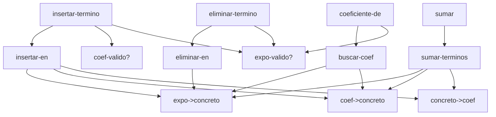
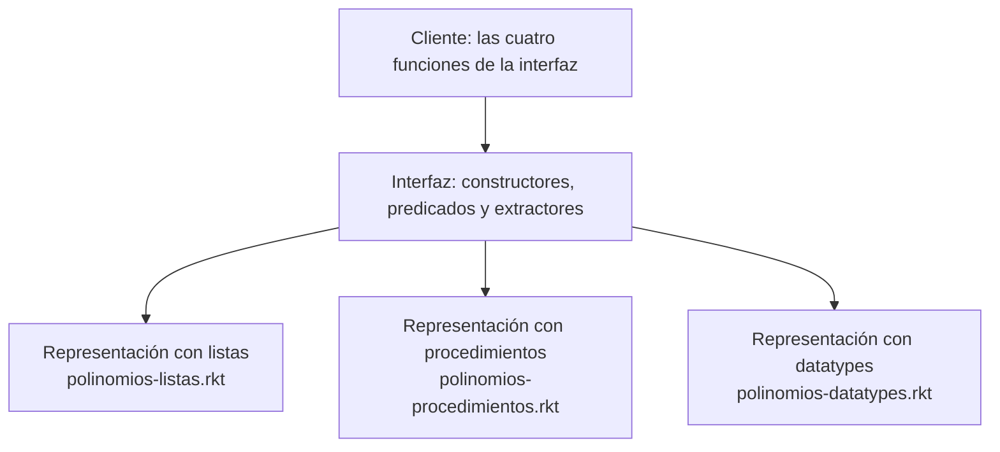

# Informe de corrección — Taller 1: Un TAD con tres caras

**Autores:** Samuel Garcia Parra (2459476), Juan Sebastian Navarrete Rada (202459562)

Este informe demuestra que las funciones de la interfaz del TAD *polinomio disperso* cumplen su especificación y conservan el invariante de la representación. Como la lógica es la misma en las tres representaciones (listas, procedimientos y datatypes), las demostraciones se hacen **una sola vez**, por inducción estructural sobre la lista de términos que define la gramática.

## Contenido

1. [Notación, invariante y lemas](#1-notación-invariante-y-lemas)
2. [Funciones auxiliares en la representación con datatypes](#2-funciones-auxiliares-en-la-representación-con-datatypes)
3. [Corrección de `coeficiente-de`](#3-corrección-de-coeficiente-de)
4. [Corrección de `eliminar-termino`](#4-corrección-de-eliminar-termino)
5. [`insertar-termino` preserva el invariante](#5-insertar-termino-preserva-el-invariante)
6. [Equivalencia de las representaciones con listas y con procedimientos](#6-equivalencia-de-las-representaciones-con-listas-y-con-procedimientos)

---

## 1. Notación, invariante y lemas

### 1.1 Correspondencia con la gramática

La categoría recursiva de la gramática es `<terminos>`. Se escribe una lista de términos como una secuencia:

| Gramática | Notación matemática |
|---|---|
| `(sin-terminos)` | $\langle\ \rangle$ |
| `(mas-terminos (termino c k) r)` | $(c,k) :: r$ |

Para $ts = \langle (c_1,e_1), \dots, (c_n,e_n) \rangle$ se define:

- $\mathrm{exps}(ts) = \{e_1,\dots,e_n\}$, el conjunto de exponentes.
- $\mathrm{len}(ts) = n$, definida por $\mathrm{len}(\langle\ \rangle)=0$ y $\mathrm{len}((c,k)::r)=1+\mathrm{len}(r)$.
- $\mathrm{terms}(ts)=\{(c_1,e_1),\dots,(c_n,e_n)\}$, el conjunto de términos.

El coeficiente de cada término se maneja en su valor concreto (un racional exacto $q\in\mathbb{Q}$); el paso entre `coef-ent`/`coef-rac` y ese valor lo hacen las funciones de traducción (Lema 2).

### 1.2 Invariante de la representación

$\mathrm{Inv}(ts)$ vale si y solo si se cumplen las cuatro condiciones del enunciado:

- **(I1) Orden estricto:** $e_1 > e_2 > \dots > e_n$.
- **(I2) Sin ceros:** $c_i \neq 0$ para todo $i$.
- **(I3) Exponentes naturales:** $e_i \in \mathbb{N}$ (enteros exactos $\geq 0$) para todo $i$.
- **(I4) Racionales reducidos:** cada coeficiente se guarda como `coef-ent` $n$, o como `coef-rac` $a\ b$ con $b>0$ y $\gcd(\lvert a\rvert, b)=1$.

Para un polinomio $p = \mathtt{poli}(v, ts)$ se define $\mathrm{Inv}(p) \equiv \mathrm{Inv}(ts)$; la variable $v$ no tiene restricción.

### 1.3 Lemas auxiliares

**Lema 1 (cola e invariante).** Si $\mathrm{Inv}((c,k)::r)$, entonces $\mathrm{Inv}(r)$ y $\forall e' \in \mathrm{exps}(r).\ e' < k$. Además, toda subsecuencia de una lista que cumple $\mathrm{Inv}$ también cumple $\mathrm{Inv}$.

*Demostración.* (I1) es una cadena estricta $k > e_2 > \dots > e_n$. Quitarle el primer elemento, o cualquier otro, deja una cadena estricta, y todos los elementos restantes quedan por debajo de $k$ por transitividad. (I2), (I3) e (I4) son propiedades de cada término por separado, así que se conservan al quitar términos. $\square$

**Lema 2 (traducción concreto ↔ abstracto).** Sea $q$ un racional exacto de Racket. Entonces `coeficiente-concreto->abstracto`$(q)$ produce un coeficiente que cumple (I4), y `coeficiente-abstracto->concreto` lo devuelve a $q$.

*Demostración.* Si `(integer? q)`, se construye `coef-ent` $q$ y el valor de vuelta es $q$. Si no, se construye `coef-rac` $(\mathtt{numerator}\ q)\ (\mathtt{denominator}\ q)$. La referencia de Racket garantiza que, para un racional exacto, `numerator` y `denominator` dan la forma canónica: fracción irreducible con denominador positivo. Esto es (I4), y el valor de vuelta es $\mathtt{num}/\mathtt{den} = q$. La suma de dos racionales exactos es un racional exacto, así que el lema aplica también a sumas. $\square$

**Lema 3 (unicidad por exponente).** Si $\mathrm{Inv}(ts)$, para cada $e$ hay a lo sumo un término de $ts$ con exponente $e$.

*Demostración.* Consecuencia inmediata de (I1): una cadena estrictamente decreciente no repite elementos. $\square$

---

## 2. Funciones auxiliares en la representación con datatypes

En `polinomios-datatypes.rkt` cada función de la interfaz delega el trabajo en una o más funciones auxiliares. Las razones son dos, y las dos buscan lo mismo: **no repetir la misma lógica en cada función de la interfaz y hacer el código más legible**.

1. **Evitar repetir lógica.** Varias funciones necesitan los mismos pasos básicos. Si cada una los reescribiera, el mismo `cases` y la misma traducción aparecerían copiados en varios lugares, y un error corregido en uno quedaría vivo en los otros.
2. **Legibilidad.** Una función de interfaz queda reducida a dos cosas: validar sus entradas y abrir el polinomio con un `cases`. El recorrido recursivo vive aparte, con nombre propio.

### 2.1 Qué se factoriza

| Auxiliar | Qué factoriza | Usos (excluyendo su definición) |
|---|---|---|
| `concreto->coef` | número de Racket → `coef-ent` o `coef-rac` | 4, desde `insertar-en` y `sumar-terminos` |
| `coef->concreto` | `coef-ent` o `coef-rac` → número de Racket | 5, desde `insertar-en`, `buscar-coef`, `sumar-terminos` y `terminos->lista` |
| `concreto->expo` y `expo->concreto` | entero ↔ `expo-nat` | 2 y 6; esta última aparece en las cinco funciones que recorren términos |
| `expo-valido?` | exponente entero exacto $\geq 0$ | 3: `insertar-termino`, `coeficiente-de`, `eliminar-termino` |
| `coef-valido?` | coeficiente racional exacto | 1: `insertar-termino` |
| `insertar-en` | recorrido de `terminos` para insertar | `insertar-termino` |
| `buscar-coef` | recorrido de `terminos` para consultar | `coeficiente-de` |
| `eliminar-en` | recorrido de `terminos` para eliminar | `eliminar-termino` |
| `sumar-terminos` | recorrido paralelo de dos `terminos` | `sumar` |
| `terminos->lista` | vista concreta de los términos, útil para depurar | auxiliar interna |

El criterio de diseño es que **la interfaz recibe un `polinomio` pero la recursión se hace sobre `terminos`**, que es la categoría recursiva de la gramática. Por eso cada función de la interfaz abre el polinomio una vez con `cases` y entrega solo la lista de términos a su auxiliar. Esas auxiliares son exactamente las funciones que se demuestran en las secciones 3, 4 y 5.

### 2.2 Estructura de llamadas



### 2.3 Encapsulamiento

El `provide` de `polinomios-datatypes.rkt` exporta solo `polinomio-cero`, `insertar-termino`, `coeficiente-de`, `eliminar-termino` y `sumar`. Las auxiliares no se exportan: son un detalle de implementación y el cliente no puede llamarlas. Eso mantiene intacta la barrera de abstracción que pide el enunciado.

### 2.4 Correspondencia de nombres entre archivos

La lógica es la misma en los tres archivos. Solo cambian los nombres de las auxiliares recursivas:

| Lógica | `polinomios-listas.rkt` y `polinomios-procedimientos.rkt` | `polinomios-datatypes.rkt` |
|---|---|---|
| Consulta recursiva | `coeficiente-de-terminos` | `buscar-coef` |
| Eliminación recursiva | `eliminar-termino-terminos` | `eliminar-en` |
| Inserción recursiva | `insertar-termino-terminos` | `insertar-en` |
| Traducción a abstracto | `coeficiente-concreto->abstracto` | `concreto->coef` |
| Traducción a concreto | `coeficiente-abstracto->concreto` | `coef->concreto` |

En lo que sigue se usan las abreviaturas $\mathrm{CD}$, $\mathrm{EL}$ e $\mathrm{INS}$ para la consulta, la eliminación y la inserción recursivas sobre una lista de términos.

---

## 3. Corrección de `coeficiente-de`

### 3.1 Especificación

Sea $\mathrm{CD}(ts, e)$ la función recursiva sobre la lista de términos (`buscar-coef` / `coeficiente-de-terminos`).

- **Pre-condición:** $\mathrm{Inv}(ts)$ y $e \in \mathbb{N}$.
- **Post-condición:**
  - si $e \in \mathrm{exps}(ts)$, retorna el único $q$ tal que $(q,e) \in \mathrm{terms}(ts)$;
  - si $e \notin \mathrm{exps}(ts)$, levanta el error `"El polinomio no tiene termino con ese exponente"`.

La función `coeficiente-de` sobre un polinomio $\mathtt{poli}(v, ts)$ solo extrae $ts$ y llama a $\mathrm{CD}(ts,e)$. En `datatypes` además verifica antes que $e$ sea un exponente válido, lo que hace cumplir la pre-condición.

### 3.2 Definición por ecuaciones

El código equivale a:

$$
\mathrm{CD}(\langle\ \rangle, e) = \mathbf{error}
$$

$$
\mathrm{CD}((c,k)::r,\ e) =
\begin{cases}
c & \text{si } k = e\\
\mathbf{error} & \text{si } k < e\\
\mathrm{CD}(r, e) & \text{si } k > e
\end{cases}
$$

### 3.3 Teorema 1 (corrección parcial)

> Para toda lista $ts$ con $\mathrm{Inv}(ts)$ y todo $e\in\mathbb{N}$, $\mathrm{CD}(ts,e)$ cumple la post-condición.

*Demostración.* Por inducción estructural sobre $ts$. La hipótesis de inducción se plantea para toda $e$.

**Caso base: $ts = \langle\ \rangle$.** No hay exponentes, así que $e\notin\mathrm{exps}(ts)$. La ecuación 1 levanta el error, que es lo que exige la post-condición.

**Paso inductivo: $ts = (c,k)::r$** con $\mathrm{Inv}(ts)$. Por el Lema 1, $\mathrm{Inv}(r)$ y todos los exponentes de $r$ son menores que $k$. Como $\mathrm{exps}(ts) = \{k\}\cup\mathrm{exps}(r)$, hay tres casos:

1. **$k = e$.** Entonces $e \in \mathrm{exps}(ts)$ y el código retorna $c$, que es el coeficiente del término $(c,e)$. Por el Lema 3 es el único. Por el Lema 2, `coef->concreto` devuelve exactamente el valor guardado.
2. **$k < e$.** Todos los exponentes de $ts$ son $\leq k < e$, por (I1). Entonces $e \notin \mathrm{exps}(ts)$ y el código levanta el error. Es correcto, y es aquí donde el orden permite parar sin recorrer el resto.
3. **$k > e$.** El código retorna $\mathrm{CD}(r,e)$. Como $k \neq e$, se cumple $e\in\mathrm{exps}(ts) \iff e\in\mathrm{exps}(r)$, y los términos de $ts$ con exponente $e$ son los mismos que los de $r$. Como $\mathrm{Inv}(r)$ vale, la **hipótesis de inducción** aplica a $r$:
   - si $e\in\mathrm{exps}(r)$, $\mathrm{CD}(r,e)$ retorna el coeficiente correcto, que también lo es para $ts$;
   - si $e\notin\mathrm{exps}(r)$, $\mathrm{CD}(r,e)$ levanta el error, que también es correcto para $ts$. $\square$

### 3.4 Terminación

Se toma como medida $\mu(ts,e) = \mathrm{len}(ts) \in \mathbb{N}$.

- La única llamada recursiva es $\mathrm{CD}(r,e)$ en el caso $k>e$, y $\mu(r,e) = \mu(ts,e) - 1 < \mu(ts,e)$.
- La medida toma valores en $\mathbb{N}$, que está bien fundado, así que no existe una cadena infinita de llamadas.
- El caso con $\mu = 0$ (`sin-terminos`) no hace llamada recursiva.

Por tanto $\mathrm{CD}$ **termina siempre**. Además hace trabajo constante por llamada y visita cada celda de la lista a lo sumo una vez, de modo que recorre la lista **una sola vez**.

---

## 4. Corrección de `eliminar-termino`

### 4.1 Especificación

Sea $\mathrm{EL}(ts,e)$ la función recursiva (`eliminar-en` / `eliminar-termino-terminos`).

- **Pre-condición:** $\mathrm{Inv}(ts)$ y $e \in \mathbb{N}$.
- **Post-condición:**
  - si $e\in\mathrm{exps}(ts)$, sea $(c_e,e)$ el único término con ese exponente. Retorna $ts'$ tal que:
    - **(a)** $\mathrm{terms}(ts') = \mathrm{terms}(ts)\setminus\{(c_e,e)\}$, es decir, contiene exactamente los términos del original menos el eliminado;
    - **(b)** $ts'$ es una subsecuencia de $ts$ (se conserva el orden relativo de los demás términos);
    - **(c)** $\mathrm{Inv}(ts')$;
  - si $e\notin\mathrm{exps}(ts)$, levanta el error `"El polinomio no tiene termino con ese exponente"`.

### 4.2 Definición por ecuaciones

$$
\mathrm{EL}(\langle\ \rangle, e) = \mathbf{error}
$$

$$
\mathrm{EL}((c,k)::r,\ e) =
\begin{cases}
r & \text{si } k = e\\
\mathbf{error} & \text{si } k < e\\
(c,k) :: \mathrm{EL}(r,e) & \text{si } k > e
\end{cases}
$$

### 4.3 Teorema 2 (corrección parcial)

> Para toda lista $ts$ con $\mathrm{Inv}(ts)$ y todo $e\in\mathbb{N}$, $\mathrm{EL}(ts,e)$ cumple la post-condición.

*Demostración.* Por inducción estructural sobre $ts$.

**Caso base: $ts=\langle\ \rangle$.** $e \notin \mathrm{exps}(ts)$ y la ecuación 1 levanta el error. ✓

**Paso inductivo: $ts=(c,k)::r$** con $\mathrm{Inv}(ts)$. Por el Lema 1, $\mathrm{Inv}(r)$ y $\forall e'\in\mathrm{exps}(r).\ e'<k$.

1. **$k=e$.** El resultado es $ts' = r$.
   - (a) Por el Lema 3, $(c,e)$ es el único término con exponente $e$, de modo que $\mathrm{terms}(r)=\mathrm{terms}(ts)\setminus\{(c,e)\}$.
   - (b) $r$ es la cola de $ts$, que es una subsecuencia.
   - (c) $\mathrm{Inv}(r)$ por el Lema 1.
2. **$k<e$.** Todos los exponentes de $ts$ son $\leq k<e$, así que $e\notin\mathrm{exps}(ts)$. El error es lo correcto.
3. **$k>e$.** El resultado es $(c,k)::\mathrm{EL}(r,e)$.
   - *Si $e\notin\mathrm{exps}(r)$:* como $k\neq e$, tampoco está en $ts$. Por la hipótesis de inducción, $\mathrm{EL}(r,e)$ levanta el error, que se propaga. ✓
   - *Si $e\in\mathrm{exps}(r)$:* por la **hipótesis de inducción**, $r' = \mathrm{EL}(r,e)$ cumple (a), (b), (c) respecto de $r$. Sea $ts' = (c,k)::r'$.
     - (a) $\mathrm{terms}(ts') = \{(c,k)\}\cup\big(\mathrm{terms}(r)\setminus\{(c_e,e)\}\big) = \mathrm{terms}(ts)\setminus\{(c_e,e)\}$, porque $(c,k)\neq(c_e,e)$ ya que $k\neq e$.
     - (b) $r'$ es subsecuencia de $r$, y anteponer el mismo primer elemento a ambas conserva la relación, de modo que $ts'$ es subsecuencia de $ts$.
     - (c) $ts'$ es subsecuencia de $ts$ y $\mathrm{Inv}(ts)$ vale, así que $\mathrm{Inv}(ts')$ por el Lema 1. $\square$

### 4.4 Terminación

La medida es $\mu(ts,e)=\mathrm{len}(ts)$, igual que en la sección 3.4. La única llamada recursiva es $\mathrm{EL}(r,e)$ con $\mathrm{len}(r)=\mathrm{len}(ts)-1<\mathrm{len}(ts)$, y en $\mathrm{len}=0$ no se llama a nadie. Por tanto $\mathrm{EL}$ termina siempre y recorre la lista una sola vez, sin ordenar al final: el resultado conserva el orden porque es una subsecuencia.

---

## 5. `insertar-termino` preserva el invariante

### 5.1 Enunciado

La función `insertar-termino` valida primero sus argumentos: el exponente debe ser un entero exacto $\geq 0$ y el coeficiente un número exacto; si no, levanta un error y no retorna ningún polinomio. Si pasa la validación, conserva la variable del polinomio y delega en la función recursiva $\mathrm{INS}(ts,c,e)$ (`insertar-en` / `insertar-termino-terminos`).

El invariante se enuncia como la propiedad $\mathrm{Inv}(p)$ de la sección 1.2.

> **Teorema 3.** Sea $p=\mathtt{poli}(v,ts)$ con $\mathrm{Inv}(p)$, $c\in\mathbb{Q}$ exacto y $e\in\mathbb{N}$. Si `insertar-termino` retorna $p'$, entonces $\mathrm{Inv}(p')$.

Como la validación garantiza $e \in \mathbb{N}$ y $c$ exacto, y la variable no se modifica, basta probar el siguiente enunciado sobre la función recursiva.

> **Lema 4.** Si $\mathrm{Inv}(ts)$, $c\in\mathbb{Q}$ y $e\in\mathbb{N}$, entonces $\mathrm{Inv}(\mathrm{INS}(ts,c,e))$ y además $\mathrm{exps}(\mathrm{INS}(ts,c,e)) \subseteq \mathrm{exps}(ts)\cup\{e\}$.

La segunda parte refuerza la hipótesis de inducción: se necesita en el caso recursivo para saber que el primer exponente sigue siendo el mayor.

### 5.2 Definición por ecuaciones

$$
\mathrm{INS}(\langle\ \rangle, c, e) =
\begin{cases}
\langle\ \rangle & \text{si } c = 0\\
\langle (c,e)\rangle & \text{si } c \neq 0
\end{cases}
$$

Para $ts=(a,k)::r$:

$$
\mathrm{INS}((a,k)::r,\ c,\ e) =
\begin{cases}
(a,k)::r & \text{si } e>k \text{ y } c=0\\
(c,e)::(a,k)::r & \text{si } e>k \text{ y } c\neq0\\
r & \text{si } e=k \text{ y } a+c=0\\
(a+c,\ k)::r & \text{si } e=k \text{ y } a+c\neq0\\
(a,k)::\mathrm{INS}(r,c,e) & \text{si } e<k
\end{cases}
$$

### 5.3 Demostración del Lema 4

Por inducción estructural sobre $ts$. En cada caso se verifican las cuatro condiciones (I1)–(I4) y la inclusión de exponentes. Los **tres casos que pide el enunciado** son los casos 1, 2 y 3 del paso inductivo (junto con el caso base, que es el de exponente nuevo cuando la lista se acaba).

**Caso base: $ts=\langle\ \rangle$.** *(Exponente nuevo.)*

- Si $c=0$, el resultado es $\langle\ \rangle$, que cumple $\mathrm{Inv}$ trivialmente, con $\mathrm{exps}=\emptyset$.
- Si $c\neq0$, el resultado es $\langle(c,e)\rangle$. Un solo término cumple (I1). (I2) vale porque $c\neq0$. (I3) vale porque $e\in\mathbb{N}$. (I4) vale por el Lema 2. Además $\mathrm{exps}=\{e\}$.

**Paso inductivo: $ts=(a,k)::r$** con $\mathrm{Inv}(ts)$. Por el Lema 1, $\mathrm{Inv}(r)$ y todos los exponentes de $r$ son menores que $k$; por (I2) y (I4) del invariante, $a\neq0$ y $a$ está reducido. Se distinguen los casos según la comparación de $e$ con $k$.

**Caso 1 — el exponente es nuevo y va antes de la cabeza ($e>k$).** Como todos los demás exponentes son menores que $k$, $e\notin\mathrm{exps}(ts)$.

- Si $c=0$, el resultado es $ts$ sin cambios: $\mathrm{Inv}(ts)$ ya vale. Esto es lo que impide crear un término con coeficiente cero.
- Si $c\neq0$, el resultado es $(c,e)::(a,k)::r$.
  - (I1): $e>k>$ (todos los demás), así que la cadena sigue siendo estrictamente decreciente.
  - (I2): $c\neq0$ y los demás ya eran distintos de cero.
  - (I3): $e\in\mathbb{N}$ por la validación.
  - (I4): Lema 2 para $c$; los demás ya cumplían.
  - Exponentes: $\mathrm{exps}=\{e\}\cup\mathrm{exps}(ts)$. ✓

**Caso 2 — el exponente ya existía y la suma no es cero ($e=k$, $a+c\neq0$).** El resultado es $(a+c,k)::r$, con $s=a+c$.

- (I1): el primer exponente sigue siendo $k$, y $k>$ todos los de $r$. La cadena no cambia.
- (I2): $s\neq0$ por hipótesis del caso.
- (I3): $k$ ya era natural.
- (I4): $s$ es un racional exacto, así que el Lema 2 garantiza que se guarda reducido y con denominador positivo; en particular, si $s$ es entero se guarda como `coef-ent`.
- Exponentes: $\mathrm{exps}$ no cambia. ✓

**Caso 3 — el exponente ya existía y la suma es cero ($e=k$, $a+c=0$).** El resultado es $r$.

- $\mathrm{Inv}(r)$ vale por el Lema 1. El término desaparece, de modo que no queda ningún coeficiente cero (I2).
- Exponentes: $\mathrm{exps}(r)\subseteq\mathrm{exps}(ts)\cup\{e\}$. ✓

**Caso recursivo — $e<k$.** El resultado es $(a,k)::r'$ con $r'=\mathrm{INS}(r,c,e)$. Aquí actúa la **hipótesis de inducción** sobre $r$, que cumple $\mathrm{Inv}(r)$:

- $\mathrm{Inv}(r')$ y $\mathrm{exps}(r')\subseteq\mathrm{exps}(r)\cup\{e\}$.
- (I1): $k>$ todos los exponentes de $r$ (Lema 1) y $k>e$ (hipótesis del caso). Como $\mathrm{exps}(r')\subseteq\mathrm{exps}(r)\cup\{e\}$, $k$ es mayor que todos los exponentes de $r'$. Junto con (I1) de $r'$, la cadena completa es estrictamente decreciente.
- (I2), (I3), (I4): el término $(a,k)$ ya cumplía el invariante y $r'$ lo cumple por hipótesis.
- Exponentes: $\{k\}\cup\mathrm{exps}(r')\subseteq\mathrm{exps}(ts)\cup\{e\}$. $\square$

### 5.4 Resumen: los tres casos del enunciado

| Caso del enunciado | Dónde se demuestra | Por qué se conserva $\mathrm{Inv}$ |
|---|---|---|
| **Exponente nuevo** | Caso base, Caso 1 y, para llegar a ellos, el caso recursivo | El término nuevo se coloca entre exponentes mayores y menores, así que (I1) se mantiene. Si $c=0$ no se inserta nada |
| **Exponente existente, suma $\neq 0$** | Caso 2 | Se sustituye el coeficiente y se conserva la posición. El Lema 2 garantiza que quede reducido |
| **Exponente existente, suma $= 0$** | Caso 3 | El término se elimina; la cola ya cumplía el invariante (Lema 1) |

### 5.5 Terminación

La medida es $\mathrm{len}(ts)$. La única llamada recursiva es $\mathrm{INS}(r,c,e)$ en el caso $e<k$, con $\mathrm{len}(r)=\mathrm{len}(ts)-1$. En el caso base no hay recursión. Por tanto $\mathrm{INS}$ termina siempre.

La inserción hace **un solo recorrido** de la lista hasta el punto de inserción y **no ordena al final**: el invariante se *conserva* en cada paso en vez de restaurarse después, que es lo que la sección 4 del enunciado exige.

---

## 6. Equivalencia de las representaciones con listas y con procedimientos

### 6.1 Qué afirma el argumento

Las cuatro funciones de la interfaz (`polinomio-cero`, `insertar-termino`, `coeficiente-de`, `eliminar-termino`) son **las mismas** en `polinomios-listas.rkt` y en `polinomios-procedimientos.rkt`. Esto se comprobó comparando los dos archivos: el bloque de traducción concreto↔abstracto y de interfaz tiene 101 líneas en cada uno y son **textualmente idénticas**; la única diferencia es un comentario. Lo único que cambia entre los archivos es la **capa de datos**, es decir, cómo están definidos los constructores, predicados y extractores.

### 6.2 Dos representaciones de un mismo constructor

La sección 2.2 de EOPL presenta la representación con listas y con procedimientos como dos maneras de implementar la misma especificación. Aquí, para `poli`:

```racket
;; Representación con listas
(define poli       (lambda (var terms) (list 'poli var terms)))
(define poli->var  (lambda (valor) (cadr valor)))
(define poli->terms (lambda (valor) (caddr valor)))
```

```racket
;; Representación con procedimientos
(define poli
  (lambda (var terms)
    (lambda (msg)
      (cond
        ((equal? msg 'tipo) 'poli)
        ((equal? msg 'var) var)
        ((equal? msg 'terms) terms)
        (else (eopl:error 'poli "Mensaje desconocido: ~a" msg))))))
(define poli->var   (lambda (valor) (valor 'var)))
(define poli->terms (lambda (valor) (valor 'terms)))
```

En la primera, un `poli` es una lista con etiqueta. En la segunda, es un procedimiento que responde al mensaje de cada campo y no deja ver su estructura interna. Lo mismo ocurre con las otras siete variantes de la gramática.

### 6.3 La propiedad de la interfaz que hace indistinguibles a las dos

El cliente solo puede relacionarse con los datos a través de constructores y observadores, y para ellos ambas representaciones cumplen las **mismas ecuaciones**. Por ejemplo, para todo $v$, $t$, $x$, $r$:

$$
\mathtt{poli\text{-}>var}(\mathtt{poli}(v,t)) = v \qquad
\mathtt{poli\text{-}>terms}(\mathtt{poli}(v,t)) = t
$$

$$
\mathtt{mas\text{-}terminos\text{-}>term}(\mathtt{mas\text{-}terminos}(x,r)) = x \qquad
\mathtt{mas\text{-}terminos\text{-}>resto}(\mathtt{mas\text{-}terminos}(x,r)) = r
$$

$$
\mathtt{sin\text{-}terminos?}(\mathtt{sin\text{-}terminos}()) = \text{verdadero} \qquad
\mathtt{sin\text{-}terminos?}(\mathtt{mas\text{-}terminos}(x,r)) = \text{falso}
$$

(y análogamente para `termino`, `coef-ent`, `coef-rac`, `expo-nat`). Esas ecuaciones son *todo* lo que las funciones de la interfaz necesitan saber de los datos.

La propiedad que lo garantiza es la **barrera de abstracción**, que se sostiene por tres hechos:

1. **Ninguna función de la interfaz inspecciona la representación.** En el bloque de interfaz no aparece `car`, `cdr`, `cadr`, `caddr`, `cons` ni `list`: solo se usan los constructores (`poli`, `mas-terminos`, `termino`, ...), los predicados (`sin-terminos?`, `coef-ent?`) y los extractores (`mas-terminos->resto`, `termino->expo`, ...). Sustituir la capa de datos no cambia ni una línea de esas funciones.
2. **La representación no se exporta.** El `provide` de ambos archivos solo exporta las cuatro funciones de la interfaz. El cliente no recibe los constructores ni los extractores, y no puede construir ni abrir un polinomio por su cuenta.
3. **Lo que el cliente observa son valores concretos.** `coeficiente-de` retorna un número de Racket y los errores son los mismos mensajes. El polinomio es un valor opaco que solo se puede pasar de una función de la interfaz a otra.

### 6.4 Esbozo del razonamiento

Sin pretender una demostración formal: se relacionan un valor construido con listas y su contraparte construida con procedimientos cuando todos sus observadores devuelven resultados relacionados, y los datos básicos (números, símbolos) solo se relacionan si son iguales.

- Cada constructor transforma argumentos relacionados en resultados relacionados, y cada observador transforma entradas relacionadas en salidas relacionadas, porque ambos cumplen las mismas ecuaciones de la sección 6.3.
- Las cuatro funciones de la interfaz son el **mismo texto** construido solo con esas operaciones. Por inducción sobre la estructura de la lista de términos (la misma de las secciones 3 a 5), mandan entradas relacionadas a salidas relacionadas.
- En la frontera del TAD, el cliente solo ve números, símbolos y errores. Ahí "relacionado" significa "igual". Por tanto, **cualquier programa cliente produce el mismo resultado con una representación que con la otra**.

Esto es lo que el taller llama *unicidad*: las funciones se escriben una vez contra la interfaz y sirven sin cambios sobre ambas representaciones. En el código, `pruebas-polinomios.rkt` evidencia lo mismo, porque define una sola batería de pruebas, `pruebas-interfaz`, parametrizada por las cuatro funciones, que se instancia con cada representación.

### 6.5 Alcance

La equivalencia vale para los programas que respetan los contratos de la interfaz. Fuera de ellos, por ejemplo al aplicar un extractor a un dato de otra variante, los errores internos de Racket pueden diferir entre las dos representaciones, pero ese comportamiento queda fuera de la especificación.

La representación con `define-datatype` también implementa la misma interfaz con la misma lógica. Sus auxiliares (sección 2) siguen el mismo esquema de recursión sobre `terminos`, por lo que los teoremas 1, 2 y 3 se aplican a ella directamente.


